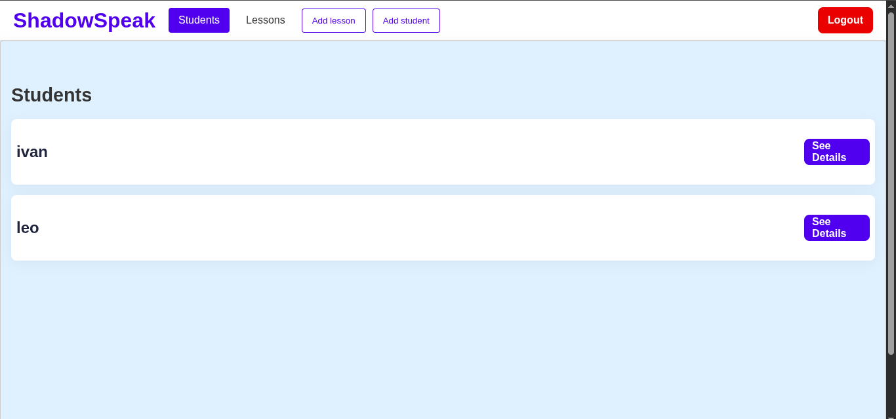

# Shadowing App – Project Specification

An app to help English learners improve their spoken English by mimicking native speech. Users practice by shadowing video clips from YouTube, recording their voice, and receiving feedback on pronunciation and intonation.

---

## Tech Stack

- **Frontend:** React, Css, Next.js
- **Backend:** Express.js, PostgreSQL
- **Audio Analysis:** Azure Speech API (for pronunciation scoring).
- **Media:** YouTube API for video import, `react-youtube` for playback

---

---

## MV

### Phase 1: Student MVP (No Login)

#### Student Functionality

- No login required
- Browse list of practice videos (YouTube)
- Video playback in 10–15 second looped segments
- Record voice using browser mic
- Submit and save recordings
- View list of past recordings

---

### Phase 2: Add Auth + Teacher Role

#### Authentication & Roles

- login (student or teacher)
- Role-based redirect to correct dashboard after login

#### Student Enhancements

- Save recordings per logged-in user
- Persist history and feedback

#### Teacher Functionality

- Upload or assign video URLs
- View student recordings for each video
- Leave text feedback per submission

---

## Stretch Goals

- AI-generated feedback (Azure Speech API)
- As a student, I want to get AI feedback on my pronunciation.

---

## Student User Stories

- As a student, I want to choose a video and shadow it by repeating short segments.
- As a student, I want to record my voice and compare it to the native speaker.
- As a student, I want to save and replay my recordings.

---

## Teacher User Stories

- As a teacher, I want to upload or assign YouTube videos to students.
- As a teacher, I want to see all submissions for a video and listen to them.
- As a teacher, I want to leave text feedback for each student submission.

---

## MVP Task List

### Phase 1 Tasks (Student MVP – No Login)

- [x ] Student dashboard: view & play videos
- [ ] Video segment playback (looping 10–15s)
- [x ] Audio recording component (mic access + playback)
- [ ] Save recording (anonymously or to local/session storage)
- [x] Display native and user audio side-by-side
- [ ] Get pronunciation feedback using Azure Speech API stretch goal
- [x ] Basic UI styling with CSS

---

### Phase 2 Tasks (Auth + Teacher Features)

- [x ] Add Auth with role selection
- [x ] Role-based routing (student/teacher)
- [x ] Save recordings linked to logged-in users
- [ ] Teacher dashboard: upload videos, view student submissions
- [ ] Feedback text input & save per recording
